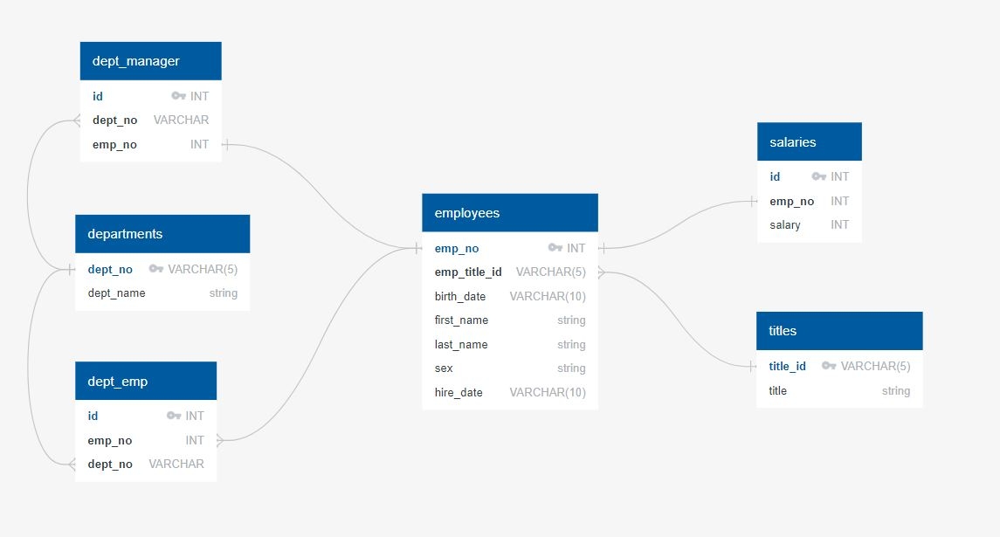
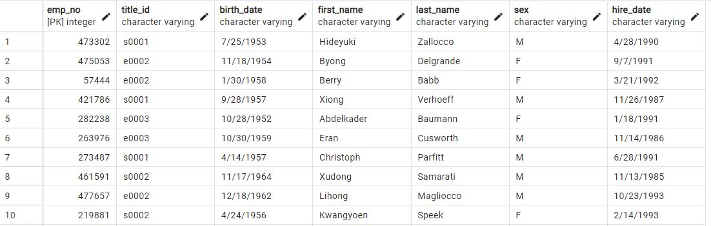
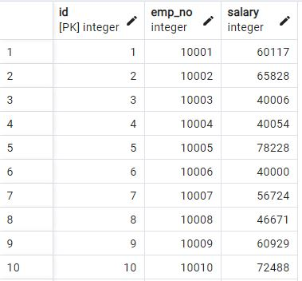
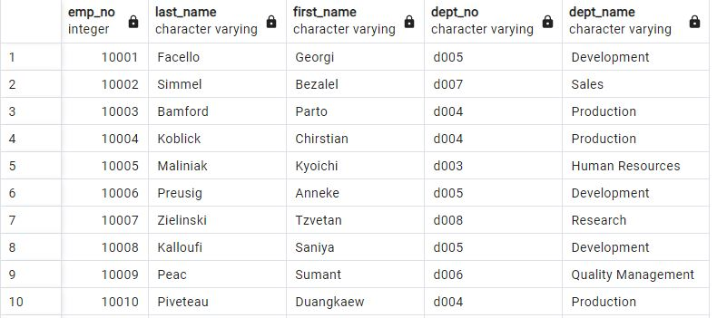

**UCB Data Analysis Module 9**
## SQL Challenge: Data Engineering

---------------
### Purpose:
A data research project pertaining to employees who worked at "Pewlett Hackard" (fictional company) during the 1980s and 1990s. All that remains of the employee database from that period are six CSV files which will be analyzed in three parts.  

**Part 1: Data Modeling**  
- Generate an Entity Relationship Diagram to map all details of the proposed relational database.  This includes data types, primary keys, foreign keys and other constraints.

  

**Part 2: Data Engineering**  
- Create a table schema to accommodate all six .csv data files using PostgreSQL 14 (via pgAdmin 4). *Sample code and output follow.*

  ```
  -- Create table for employees.
  -- Assign columm header for "emp_title_id" as "title_id".
  CREATE TABLE employees (
  	emp_no INT PRIMARY KEY NOT NULL,
  	title_id VARCHAR(5) NOT NULL,
  	FOREIGN KEY (title_id) REFERENCES titles(title_id),
  	birth_date VARCHAR(10),
  	first_name VARCHAR(20) NOT NULL,
  	last_name VARCHAR(25) NOT NULL,
  	sex VARCHAR(1),
  	hire_date VARCHAR(10) NOT NULL);
  
  -- Create table for salaries.
  CREATE TABLE salaries (
  	id SERIAL PRIMARY KEY,
  	emp_no INT,
  	FOREIGN KEY (emp_no) REFERENCES employees(emp_no),
  	salary INT);
  	
  -- View each new table with imported data.
  SELECT * FROM departments;
  SELECT * FROM titles;
  SELECT * FROM employees;
  SELECT * FROM dept_emp;
  SELECT * FROM dept_manager;
  SELECT * FROM salaries;  
  ```

  (employees)
  
  
  (salaries)  
  

**Part 3: Data Analysis**  
- Write queries to answer an array of questions by referencing information contained within the schema. *Sample code and output follow.*

  ```
  -- 4) List the dept number, employee number, last + first name and dept name for each emp.
  -- Join three tables using join with middle man (1st and 3rd have no common values)
  SELECT employees.emp_no, employees.last_name, employees.first_name,
  	dept_emp.dept_no, departments.dept_name
  FROM employees
  JOIN dept_emp ON dept_emp.emp_no = employees.emp_no
    JOIN departments ON departments.dept_no = dept_emp.dept_no
  ORDER BY dept_emp.emp_no;
  ```

  
  

--------------
### Contents of Repository:
- FOLDER: Data_Modeling
  - 2 x .jpeg image files of ERD Data Model (via [QuickDBD](https://www.quickdatabasediagrams.com/))
- FOLDER: Data_Engineering
  - 1 x .sql file for table schemas
  - 6 x .jpeg images of project tables AFTER being populated with data from .csv files
  - Note: Tables were imported via schemas within PostgreSQL.
- FOLDER: Data Analysis
  - 1 x .sql file for analyzing data and answering all [8] key questions.
  - 8 x .jpeg files are snippets of the output from the associated .sql code (#1-8)
- FOLDER: data
  - 6 x .csv files are the source data for SQL tables created in PostgreSQL
- README file

-------------------
### Contributions:
N/A

------------------
### License:
[MIT](https://choosealicense.com/licenses/mit/)
